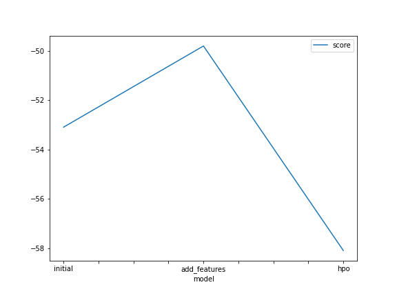
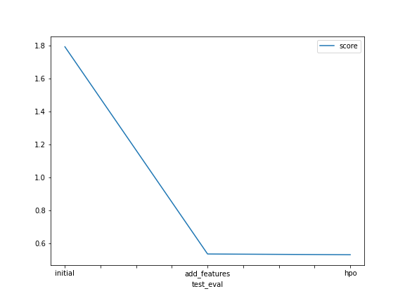

# Report: Predict Bike Sharing Demand with AutoGluon Solution
#### NAME HERE

## Initial Training
### What did you realize when you tried to submit your predictions? What changes were needed to the output of the predictor to submit your results?
We have to check if the prediction is greater than zero. If not, it is overwritten as zero.

### What was the top ranked model that performed?
WeightedEnsemble_L3 

## Exploratory data analysis and feature creation
### What did the exploratory analysis find and how did you add additional features?
- There exists a strong correlation between season and casual, temp and atemp, count and registered. So, it would be better to drop the correlated columns.
- People tend to rent as per the time in a day like rented more in 1 - 2.5 am and so on or even a particular day, so it would be better to parse a datetime into different columns (day, month and hrs).
- Categorizing different columns.

### How much better did your model preform after adding additional features and why do you think that is?
- The performance improved from 1.79236 to 0.53706 because parsing datetime played a vital role.

## Hyper parameter tuning
### How much better did your model preform after trying different hyper parameters?
- The performance improved from 0.53706 to 0.53255 as hyperparameter tuning increased little bit of performance, and it could further improved with further tuning.

### If you were given more time with this dataset, where do you think you would spend more time?
- I think I would give more time on EDA; drop more correlated columns, and if it feels like there is no more correlated columns, I would spend time on hyperparameter tuning.

### Create a table with the models you ran, the hyperparameters modified, and the kaggle score.
|model|hpo1|hpo2|hpo3|hypo4|score|
|--|--|--|--|--|--|
|initial|default|default|default|default|1.79236|
|add_features|default|default|default|default|0.53706|
|hpo|GBM: {'num_boost_round': 100, 'num_leaves': Int: lower=26, upper=66, 'num_iterations': 200, 'objective': 'huber'}|RF: {'n_estimators': 200, 'criterion': ['gini', 'entropy', 'logloss']}|KNN: {'n_neighbors': 4, 'weights': 'distance', 'algorithm': 'brute'}|XGB: {'objective': 'reg:pseudohubererror', 'eval_metric': 'rmse'}|0.53255|

### Create a line plot showing the top model score for the three (or more) training runs during the project.

### Create a line plot showing the top kaggle score for the three (or more) prediction submissions during the project.

## Summary
- This project involves the step used in whole ML lifecycle.
- Set up kaggle account, participate in competition, import kaggle dataset directly from notebook, submit files directly to kaggle.
- Involves performing basic EDDA tasks.
- Create a base model and iteratively improve the performance of the model.
